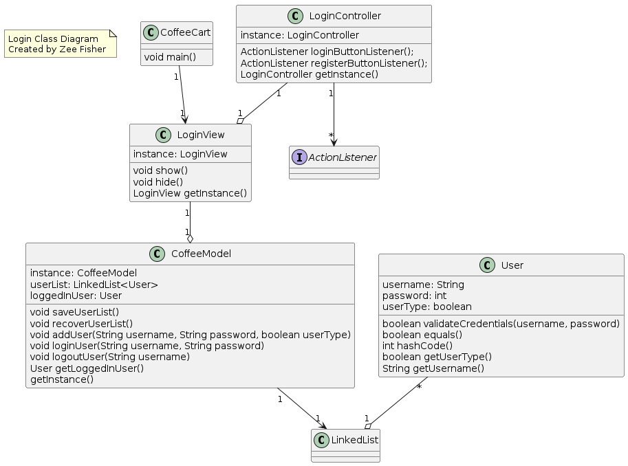
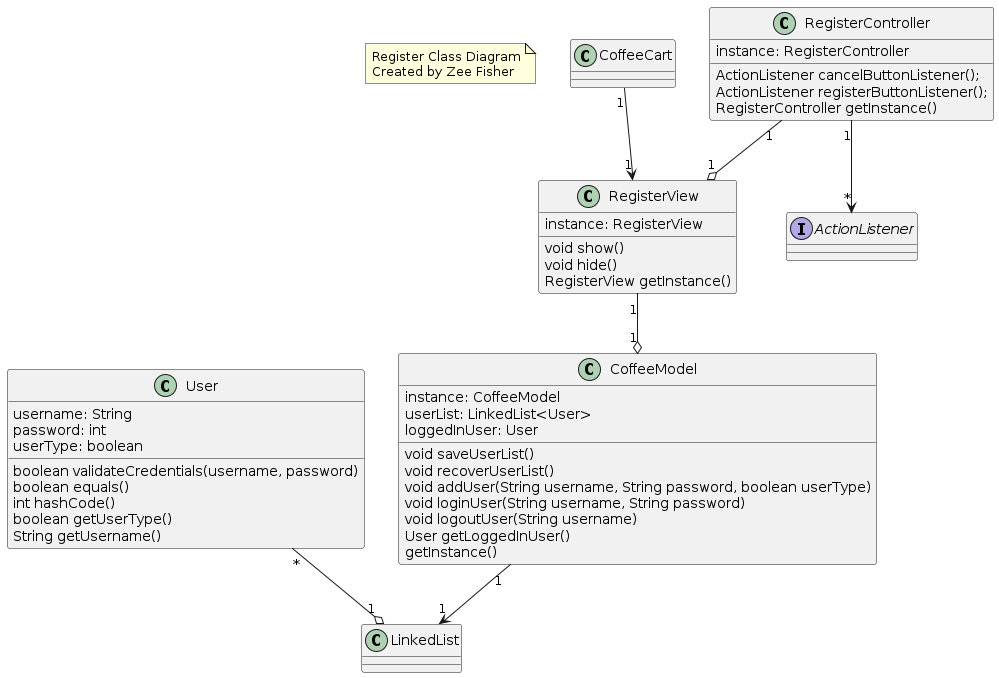
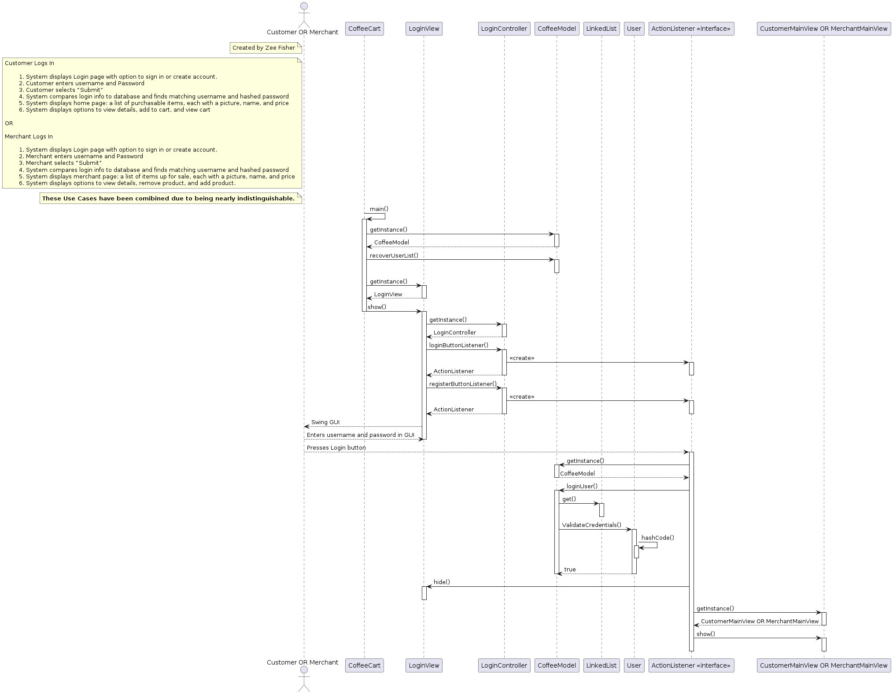
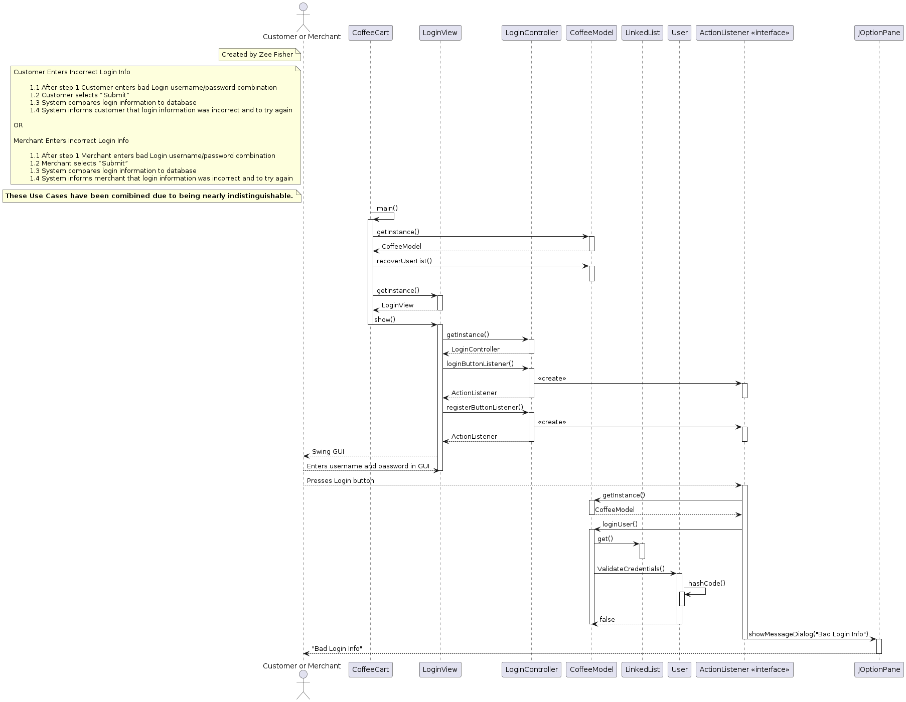
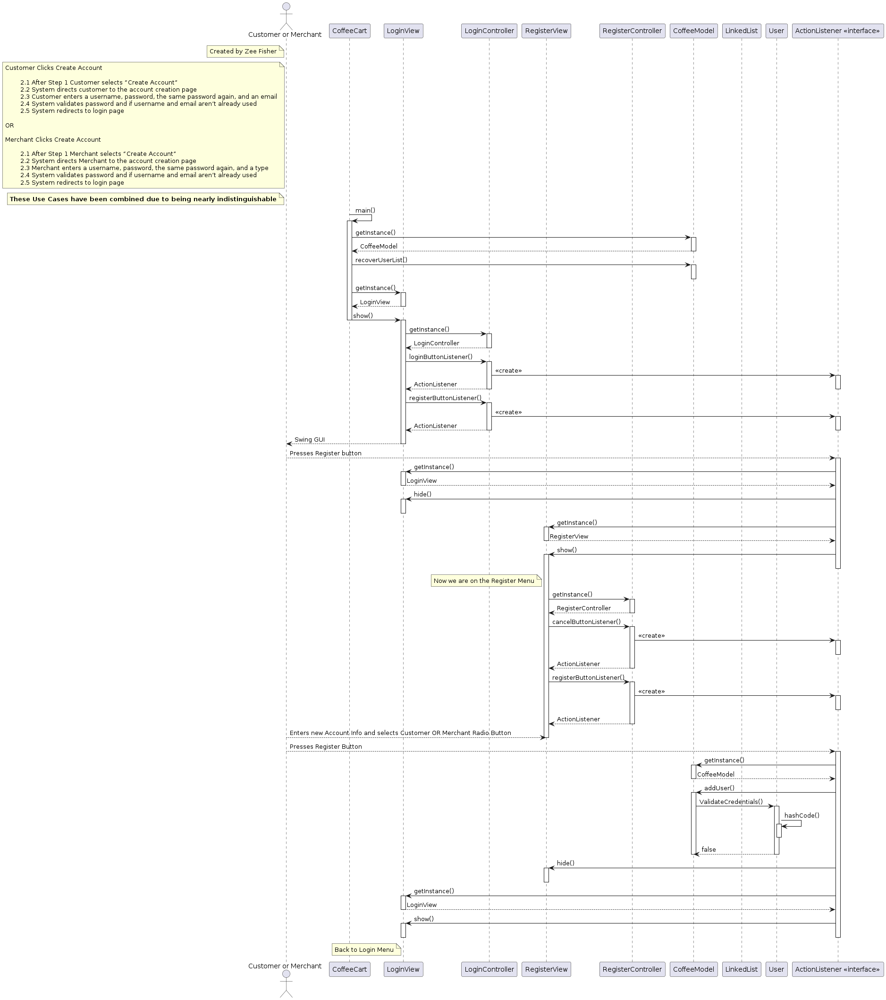
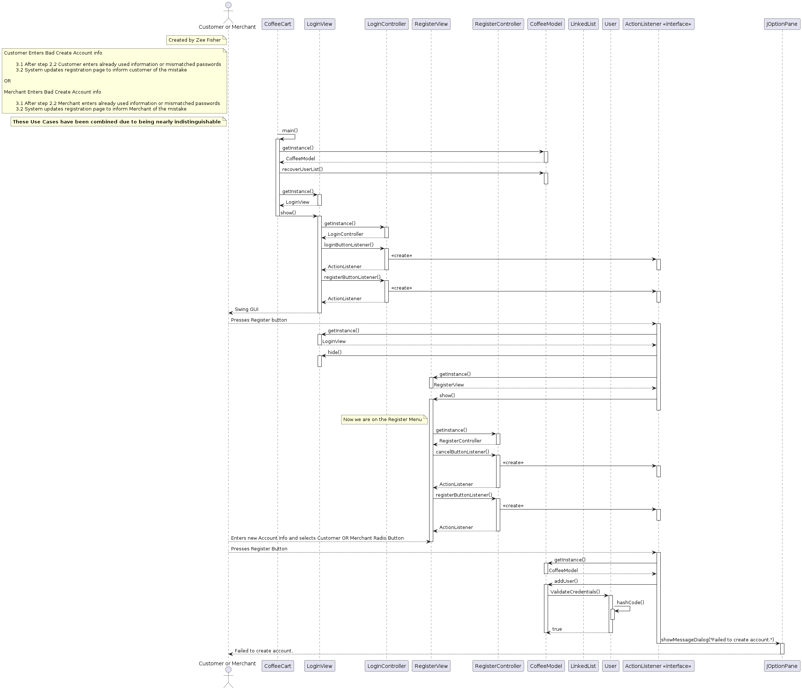

# Final Report Coffee Cart
---

# Group 29: "Coffee-Shop" Shopping Cart

This is a Java shopping cart application with a Swing UI. It logs in Customers, who can add a selection of products to a cart, and then purchase those items. Customers can even view more detailed information about a product before adding it. In the Cart, they can adjust item quantity or remove unwanted items. Merchants can also log in. Merchants may view products similarly to customers, alongside being able to edit product details, add products, and remove products.

## Team Members

 - Zee Fisher
 - Edwin Gomez
 - Charles Fernandez-Hamoui

## Glossary

 - Java : The Java programming language, compiler, and respective software platform.
 - Swing UI: GUI toolkit for Java.
 - Customer : User who purchases products from the Coffee-Shop.
 - Merchant : User who lists products to be sold on the Coffee-Shop.
 - System : Abstract component of the shop that manages its functionality.
 - Product : Purchasable item composed of a price, quantity, description, image, and name.
 - Cart : Collection of products a user wants to purchase.
 - Product Database : Database of products that can be purchased on Coffee-Shop.

## Functional Specification

 1. Registers new Customers and Merchants.
 2. Logs in new Customers and Merchants.
 3. Displays purchasable Products to Buyers.
 4. Displays currently listed Products to Merchants.
 5. Tracks Products a Buyer wants to purchase in a Cart.
 6. Reduces quantity of Products after Purchases.
 7. Adds new Products to be sold by Merchants.
 8. Increases quantity of currently listed Products.
 9. Displays revenue, sales, and profit to Merchants.

## Use Cases

### Customer Logs In

 1. System displays Login page with option to sign in or create account.

 2. Customer enters username and Password

 3. Customer selects "Submit"

 4. System compares login info to database and finds matching username and hashed password

 5. System displays home page: a list of purchasable items, each with a picture, name, and price

 6. System displays options to view details, add to cart, and view cart

### Customer Logs In -- Variations

__Customer Enters Incorrect Login Info__

 1. 1 After step 1 Customer enters bad Login username/password combination

 1. 2 Customer selects "Submit"

 1. 3 System compares login information to database

 1. 4 System informs customer that login information was incorrect and to try again

__Customer Clicks Register__

 2. 1 After Step 1 Customer selects "Register"

 2. 2 System directs customer to the account creation page

 2. 3 Customer enters a username, password, the same password again, and a type

 2. 4 System validates password and if the username isn't already used

 2. 5 System redirects to login page

__Customer Enters Bad Register info__

 3. 1 After step 2.2 Customer enters already used information or mismatched passwords

 3. 2 System updates registration page to inform customer of the mistake

### Customer Reviews Product Details

 1. Customer carries out __Customer Logs In__

 2. Customer selects item name from list

 3. System directs customer to product page: display of a products name, picture, price, merchant, and description.

 4. System displays options to "Return" to product list or to "Add to Cart"

 5. Customer selects "Return" and returns to hope page.

### Customer Adds Items to Shopping Cart

 1. Customer carries out __Customer Logs In__

 2. Customer selects "Add to cart" next to item

 3. System adds item to cart

### Customer Adds Items to Shopping Cart -- Variations

__Customer Is In Product Details__

 1. 1 Customer carries out __Customer Reviews Product Details__

 1. 2 Customer selects "Add to cart"

 1. 3 System adds item to cart

__Item already in cart.__

 2. 1 After step 2 OR 1.2 System finds item already in cart

 2. 2 System increases quantity of item in cart

### Customer Reviews/Updates Shopping Cart

 1. Customer carries out __Customer Logs In__ OR __Customer Adds Items to Shopping Cart__

 2. System displays shopping cart, a list of unique items the user wants to purchase and the quantity

 3. System displays options to return to homepage, delete item from cart, change quantity, and to checkout

 4. Customer Selects "Return to Homepage"

 5. System displays homepage

### Customer Reviews/Updates Shopping Cart -- Variations

__User Selects "Delete Item From Cart"__

 1. 1 After step 3 Customer selects "Delete Item From Cart" next to the item to delete.

 1. 2 System removes that unique item from the Customer's cart and updates the page.

__Customer Selects "Change quantity"__

 2. 1 After step 3 Customer selects "Change quantity"

 2. 2 Customer enters new quantity between 1 and the available quantity.

 2. 3 System updates new quantity in cart and page

__Customer Selects "Checkout"__

 3. 1 After step 3 Customer selects "Checkout"

 3. 2 System displays checkout page with fields for payment info and address.

 3. 3 System displays options to "Complete Checkout" or "Cancel Checkout".

### Customer Checks Out

 1. Customer carries out __Customer Reviews/Updates Shopping Cart__ variation __Customer Selects "Checkout"__

 2. Customer enters payment and address information

 3. Customer selects "Complete Checkout" which submits payment, address, and cart.

 4. System deducts each purchased Product's quantity by the amount purchased.

### Customer Checks Out -- Variations

__Customer Selects "Cancel Checkout"__

 1. 1 After step 1 OR step 2, customer selects "Cancel Checkout"

 1. 2 System returns to Cart page

### Merchant Logs In

 1. System displays Login page with option to sign in or create account.

 2. Merchant enters username and Password

 3. Merchant selects "Submit"

 4. System compares login info to database and finds matching username and hashed password

 5. System displays merchant page: a list of items up for sale, each with a picture, name, and price

 6. System displays options to view details, remove product, and add product.

### Merchant Logs In -- Variations

__Merchant Enters Incorrect Login Info__

 1. 1 After step 1 Merchant enters bad Login username/password combination

 1. 2 Merchant selects "Submit"

 1. 3 System compares login information to database

 1. 4 System informs merchant that login information was incorrect and to try again

__Merchant Clicks Register__

 2. 1 After Step 1 Merchant selects "Register"

 2. 2 System directs Merchant to the account creation page

 2. 3 Merchant enters a username, password, the same password again, and a type

 2. 4 System validates password and if the username isn't already used

 2. 5 System redirects to login page

__Merchant Enters Bad Register info__

 3. 1 After step 2.2 Merchant enters already used information or mismatched passwords

 3. 2 System updates registration page to inform Merchant of the mistake


### Merchant Reviews/Updates Inventory

 1. Merchant carries out __Merchant Logs In__

 2. Merchant selects a product name to view details

 3. System displays product details, an option to go back, and an option to edit details.

 4. Merchant selects "Edit Details" and submits new/changed details

 5. System updates product in database and for the display

### Merchant Reviews/Updates Inventory -- Variations

__Merchant Selects "Remove Product"__

 1. 1 After step 1. Merchant selects "Remove Product"

 1. 2 System prompts merchant for a confirmation

 1. 3 Merchant selects "OK"

 1. 4 System removes product

__Merchant Cancels Removing Product__

 2. 1 After step 1.2 Merchant selects "Cancel"

 2. 2 No product is removed

__Merchant edits Product Quantity__

 3. 1 After step 1. merchant selects "Edit Quantity"

 3. 2 Merchant types in a new quantity and confirms.

 3. 3 System updates quantity in Product Database.

### Merchant Adds New Product

 1. Merchant carries out  __Merchant Logs In__

 2. Merchant selects "Add Product"

 3. System displays add product page with space for product details

 4. Merchant enters product information

 5. Merchant selects "Submit"

 6. System adds product to product database

### Merchant Reviews Revenue, Sales, and Profit

 1. Merchant completes __Merchant Logs In__

 2. Merchant selects "View Stats"

 3. System displays the Merchant's Revenue, Sales, and Profit

 4. Merchant selects "Close"

 5. System hides the stats

# Login and Register components by Zee fisher

## CRC Login:

### CoffeeCart
 - **Responsibilities**
    - Initalizes the application.
    - Activates the Model of the Login page
    - Shows Login View
 - **Collaborators**
    - CoffeeModel
    - LoginView

### User
 - **Responsibilities**
    - Store username, password, and type 
    - Validate uesrname and password
    - Identifies type
 - **Collaborators**
    - LoginModel
    - LoginController

### CoffeeModel
 - **Responsibilities**
    - Manages List of Users
    - Manages User Validation
 - **Collaborators**
    - LoginView
    - ActionListener
    - LinkedList

### LoginView
 - **Responsibilities**
    - Manage login layout
    - Attach action listeners
 - **Collaborators**
    - Controller
    - JFrame, JPanel, JTextField, JPasswordField, JButton, JLabel
    - ActionListener

### LoginController
 - **Responsibilities**
    - Create ActionListeners
    - Listens to buttons
    - Validates Username and Password
 - **Collaborators**
    - LoginView
    - LoginModel
    - ActionListener
    - JOptionPane

### RegisterView
 - **responsibilities**
    - Manage register layout
 - **collaborators**
    - JFrame, JPanel, JTextField, JPasswordField, JButton, JLabel, JRadioButton

### CustomerMainView
 - **Responsibilities**
    - Manage customer main layout
 - **Collaborators**
    - JFrame, JPanel, JTextField, JPasswordField, JButton, JLabel

## CRC Register

### CoffeeCart
 - **Responsibilities**
    - Initalizes the application.
    - Activates the Model of the Login page
    - Shows Login View
 - **Collaborators**
    - CoffeeModel
    - LoginView

### User
 - **Responsibilities**
    - Store username, password, and type
    - Validate uesrname and password
    - Identifies type
 - **Collaborators**
    - LoginModel
    - LoginController

### CoffeeModel
 - **Responsibilities**
    - Manages List of Users
    - Manages User Validation
 - **Collaborators**
    - LoginView
    - ActionListener
    - LinkedList

### LoginView
 - **Responsibilities**
    - Manage login layout
    - Attach action listeners
 - **Collaborators**
    - LoginController
    - JFrame, JPanel, JTextField, JPasswordField, JButton, JLabel
    - ActionListener

### LoginController
 - **Responsibilities**
    - Create ActionListeners
    - Listens to buttons
    - Validates Username and Password
 - **Collaborators**
    - LoginView
    - LoginModel
    - ActionListener
    - JOptionPane

### RegisterView
 - **responsibilities**
    - Manage register layout
    - Attach action listeners
 - **collaborators**
    - JFrame, JPanel, JTextField, JPasswordField, JButton, JLabel, JRadioButton
    - RegisterController
    - ActionListener

### RegisterController
 - **Responsibilities**
    - Create ActionListeners
    - Listens to buttons
    - Validates Username and Password
 - **Collaborators**
    - RegisterView
    - RegisterModel
    - ActionListener
    - JOptionPane


### CustomerMainView
 - **Responsibilities**
    - Manage customer main layout
 - **Collaborators**
    - JFrame, JPanel, JTextField, JPasswordField, JButton, JLabel

## Class Diagram, Login:



## Class Diagram, Register:



## Use-Case Diagrams:






## Java for the Login and Register pages:

```

// CoffeeCart.java
// Created by Zee Fisher

/**
 * CoffeCart is the entry point of the application.
 */
public class CoffeeCart {
	
	/**
	 * main initializes the application by 
	 * recovering the list of users and showing the 
	 * login view.
	 * @param args IGNORED
	 */
	public static void main(String[] args) {

		CoffeeModel.getInstance().recoverUserList();
		LoginView.getInstance().show();
	}

}

// CoffeeModel.java
// Created by Zee Fisher

import java.util.LinkedList;
import java.util.NoSuchElementException;
import java.lang.IllegalArgumentException;
import java.io.*;
import javax.swing.JOptionPane;

/**
 * CoffeModel handles the storage, verification, and retrieval of user accounts
 */
public class CoffeeModel {

	/**
	 * Singleton Constructor
	 */
	private CoffeeModel() {}

	/**
	 * getInstance gets CoffeModel Instance
	 * @return CoffeeModel instance
	 */
	public static CoffeeModel getInstance() {
		return instance;
	}

	/**
	 * saveUserList saves the user to a file. 
	 * Private as only the CoffeModel should be saving.
	 */
	private void saveUserList() {
		try {
			ObjectOutputStream out = new ObjectOutputStream(new FileOutputStream("userList.dat"));
			out.writeObject(userList);
			out.close();
		}
		catch (Exception e) {
			System.out.println("Write error:");
			System.out.println(e);
		}
	}

	/**
	 * recoverUserList recovers user list from a file.
	 * Called initially by CoffeCart to init application.
	 */
	public void recoverUserList() {
		try {
			ObjectInputStream in = new ObjectInputStream(new FileInputStream("userList.dat"));
                        Object inputObj = in.readObject();
                        if(inputObj.getClass() == LinkedList.class) {
                                userList = new LinkedList<User>((LinkedList<User>)inputObj);
                        } else {
                                System.out.println("Error reading file. Creating blank list");
				JOptionPane.showMessageDialog(null, "Error reading user List file. Creating blank list", "Alert", JOptionPane.INFORMATION_MESSAGE); 
				userList = new LinkedList<User>();
                        }
                        in.close();	
		}
		catch (Exception e) {
			System.out.println("Error opening file. Creating blank list");
			JOptionPane.showMessageDialog(null, "Error opening user list file. Creating blank list", "Alert", JOptionPane.INFORMATION_MESSAGE); 
			userList = new LinkedList<User>();
		}
	}

	/**
	 * addUser adds a uesr to the list of user accounts.
	 * @param username Valid String username
	 * @param password Valid String password
	 * @param userType 0 for customer, 1 for merchant
	 * @throws IllegalArgumentException if the username already exists.
	 */
	public void addUser(String username, String password, boolean userType) throws IllegalArgumentException {
		for (int i = 0; i < userList.size(); i++) {
			if(userList.get(i).getUsername().equals(username)) {
				throw new IllegalArgumentException();
			}
		}
		userList.add(new User(username, password, userType));
		saveUserList();
	}

	/**
	 * loginUser logs a user in by username and password.
	 * @param username valid String username
	 * @param password valid String password
	 * @throws NoSuchElementException if there is no associated account
	 */
	public void loginUser(String username, String password) throws NoSuchElementException {
		for (int i = 0; i < userList.size(); i++) {
			if(userList.get(i).validateCredentials(username, password)) {
				loggedInUser = userList.get(i);
				if(loggedInUser.getUserType()) {
					JOptionPane.showMessageDialog(null, "Welcome, Merchant", "Welcome", JOptionPane.PLAIN_MESSAGE);	
				} else {
					JOptionPane.showMessageDialog(null, "Welcome, Customer", "Welcome", JOptionPane.PLAIN_MESSAGE);
				}
				return;
			}
		}
		throw new NoSuchElementException();
	}

	/**
	 * getLoggedInUser gets the currently logged in user.
	 * @return logged in user
	 */
	public User getLoggedInUser() {
		return loggedInUser;
	}

	private LinkedList<User> userList;
	private User loggedInUser;
	private static CoffeeModel instance = new CoffeeModel();

}


// User.java
// By Zee Fisher
import java.util.LinkedList;
import java.util.NoSuchElementException;
import java.lang.IllegalArgumentException;
import java.io.*;
import javax.swing.JOptionPane;

/**
 * User class store user account information
 */
public class User implements Serializable {

        /**
         * User constructor creats a new usre from a username, password, and type
         * @param username String username
         * @param password String password
         * @param type 0 for customer, 1 for merchant
         */
        public User(String username, String password, boolean type) {
                this.username = username;
                this.password = password.hashCode();
                this.userType = type;
        }

        /**
         * validateCredentials validates a username and password against a user.
         * @param username String username
         * @param password String password
         * @return boolean true if they are valid for this account, false otherwise
         */
        public boolean validateCredentials(String username, String password) {
                if (username.equals(this.username) && password.hashCode() == this.password) {
                        return true;
                }
                return false;
        }

        /**
         * equals compares the hash of to users to see if they are equal.
         * @param other User to compare to this User
         * @return true if they are equal in hash, false otherwise
         */
        public boolean equals(User other) {
                return this.hashCode() == other.hashCode();
        }

        /**
         * hashCode creates a hash for a user
         * @return hash created from username and password.
         */
        public int hashCode() {
                return username.hashCode() + password;
        }

        /**
         * getUserType gets the users type
         * @return 0 for customer, 1 for merchant
         */
        public boolean getUserType() {
                return userType;
        }

        /**
         * getUsername gets the username
         * @return String username.
         */
        public String getUsername() {
                return username;
        }

        private String username; // username of account
        private int password; // password of account
        private boolean userType; // 0 if customer 1 if merchant
}

// LoginView.java
// created by Zee Fisher

import java.awt.*;
import java.awt.event.*;
import javax.swing.*;

/**
 * Class Login View creates the view for the login menu
 */
public class LoginView {

	/**
	 * LoginView singleton constructor defines the elements in the GUI
	 */
	private LoginView() 
	{
		this.frame = new JFrame();
		frame.setLayout(new BoxLayout(frame.getContentPane(), BoxLayout.Y_AXIS));

		final JPanel header = new JPanel();
		header.setLayout(new BoxLayout(header, BoxLayout.X_AXIS));
		frame.add(header);

		final JLabel title = new JLabel("CoffeeCart");
		header.add(title);

		final JPanel body = new JPanel();
		body.setLayout(new BoxLayout(body, BoxLayout.Y_AXIS));
		frame.add(body);

		final JLabel loginTitle = new JLabel("Login");
		body.add(loginTitle);

		final JPanel inputs = new JPanel();
		inputs.setLayout(new BoxLayout(inputs, BoxLayout.Y_AXIS));
		body.add(inputs);

		final JLabel usernameLabel = new JLabel("Username");
		inputs.add(usernameLabel);

		final JTextField username = new JTextField();
		inputs.add(username);
		
		final JLabel passwordLabel = new JLabel("Password");
		inputs.add(passwordLabel);

		final JPasswordField password = new JPasswordField();
		inputs.add(password);

		final JPanel buttons = new JPanel();
		buttons.setLayout(new BoxLayout(buttons, BoxLayout.X_AXIS));
		body.add(buttons);

		final JButton register = new JButton("Register");
		buttons.add(register);
		register.addActionListener(LoginController.getInstance().registerButtonListener());

		final JButton login = new JButton("Login");
		buttons.add(login);
		login.addActionListener(LoginController.getInstance().loginButtonListener(username, password));

		frame.setDefaultCloseOperation(JFrame.EXIT_ON_CLOSE);
		frame.pack();
	}

	/**
	 * show, makes the menu visible
	 */
	public void show() 
	{
		this.frame.setVisible(true);
	}

	/**
	 * hide, make the menu not visible
	 */
	public void hide() 
	{
		this.frame.setVisible(false);
	}

	/**
	 * Loginview returns login singleton instance.
	 */
	public static LoginView getInstance() {
		return instance;
	}

	private final JFrame frame;
	private static LoginView instance = new LoginView();

}

// LoginController.java
// By Zee Fisher
import java.awt.*;
import java.awt.event.*;
import javax.swing.*;

/**
 * LoginController defines actions for buttons
 */
public class LoginController {

        /**
         * private singleton constructor for LoginController
         */
        private LoginController() {}

        /**
         * loginButtonListener creates a button for loggin in.
         * @param username text field that stores username
         * @param password pass field that stores password
         * @return ActionListener for button
         */
        public ActionListener loginButtonListener(final JTextField username, final JPasswordField  password) {
                return new ActionListener () {
                        public void actionPerformed(ActionEvent event) {
                                try {
                                        CoffeeModel.getInstance().loginUser(username.getText(), password.getText());
                                        LoginView.getInstance().hide();
                                        PlaceHolderView.getInstance().show();
                                }
                                catch(Exception e) {
                                        JOptionPane.showMessageDialog(null, "Invalid Username or Password.", "Bad Credentials", JOptionPane.ERROR_MESSAGE);
                                }
                        }
                };
        }


        /**
         * registerButtonListener creates a button for going to register.
         * @return ActionListener for button
         */
        public ActionListener registerButtonListener() {
                return new ActionListener () {
                        public void actionPerformed(ActionEvent e) {
                                LoginView.getInstance().hide();
                                RegisterView.getInstance().show();
                        }
                };
        }

	/**
	 * getInstance gets the instance of the LoginControllers singleton.
	 * @return LoginController
	 */
        public static LoginController getInstance() {
                return instance;
        }

        private static LoginController instance = new LoginController();
}

// RegisterView.java
// created by Zee Fisher

import java.awt.*;
import java.awt.event.*;
import javax.swing.*;

/**
 * RegisterView creates the register menu
 */
public class RegisterView {

	/**
	 * Singleton constructor for RegisterView defines GUI
	 */
	private RegisterView() 
	{
		this.frame = new JFrame();
		frame.setLayout(new BoxLayout(frame.getContentPane(), BoxLayout.Y_AXIS));

		final JPanel header = new JPanel();
		header.setLayout(new BoxLayout(header, BoxLayout.X_AXIS));
		frame.add(header);

		final JLabel title = new JLabel("CoffeeCart");
		header.add(title);

		final JPanel body = new JPanel();
		body.setLayout(new BoxLayout(body, BoxLayout.Y_AXIS));
		frame.add(body);

		final JLabel loginTitle = new JLabel("Register");
		body.add(loginTitle);

		final JPanel inputs = new JPanel();
		inputs.setLayout(new BoxLayout(inputs, BoxLayout.Y_AXIS));
		body.add(inputs);

		final JLabel usernameLabel = new JLabel("Enter Username");
		inputs.add(usernameLabel);

		final JTextField username = new JTextField("Username");
		inputs.add(username);

		final JLabel passwordLabel1 = new JLabel("Enter Password");
		inputs.add(passwordLabel1);

		final JPasswordField password1 = new JPasswordField("Password");
		inputs.add(password1);

		final JLabel passwordLabel2 = new JLabel("Enter Password Again");
		inputs.add(passwordLabel2);

		final JPasswordField password2 = new JPasswordField("Password");
		inputs.add(password2);

		final ButtonGroup typeButtons = new ButtonGroup();

		final JRadioButton customer = new JRadioButton("Customer");
		typeButtons.add(customer);
		inputs.add(customer);
		customer.setSelected(true);

		final JRadioButton merchant = new JRadioButton("Merchant");
		typeButtons.add(merchant);
		inputs.add(merchant);

		final JPanel buttons = new JPanel();
		buttons.setLayout(new BoxLayout(buttons, BoxLayout.X_AXIS));
		body.add(buttons);

		final JButton cancel = new JButton("Cancel");
		buttons.add(cancel);
		cancel.addActionListener(RegisterController.getInstance().cancelButtonListener());

		final JButton register = new JButton("Register");
		buttons.add(register);
		register.addActionListener(RegisterController.getInstance().registerButtonListener(username, password1, password2, merchant));

		frame.setDefaultCloseOperation(JFrame.EXIT_ON_CLOSE);
		frame.pack();
	}

	/**
	 *shows register menu
	 */
	public void show() 
	{
		this.frame.setVisible(true);
	}
	
	/**
	 *hides register menu
	 */
	public void hide() 
	{
		this.frame.setVisible(false);
	}

	/**
	 * gets register instance
	 * @return RegisterView
	 */
	public static RegisterView getInstance() {
		return instance;
	}

	private final JFrame frame;
	private static RegisterView instance = new RegisterView();

}


// RegisterController.java
// By Zee Fisher

import java.awt.*;
import java.awt.event.*;
import javax.swing.*;

/**
 * Creates register button action listeners
 */
public class RegisterController {

        private RegisterController() {}

        /** Action listener for resgistering
         * @param username text field for username
         * @param password1 first password field
         * @param password2 second password field
         * @param merchant merchant radio buttons
         * @return ActionListener
         * */
        public ActionListener registerButtonListener(final JTextField username, final JPasswordField  password1, final JPasswordField password2, final JRadioButton merchant) {
                return new ActionListener () {
                        public void actionPerformed(ActionEvent event) {
                                try {
                                        if(password1.getText().equals(password2.getText())) {
                                                CoffeeModel.getInstance().addUser(username.getText(), password1.getText(), merchant.isSelected());
                                                RegisterView.getInstance().hide();
                                                LoginView.getInstance().show();
                                        } else {
                                                JOptionPane.showMessageDialog(null, "Passwords Do Not Match", "Passwords Do Not Match", JOptionPane.ERROR_MESSAGE);
                                        }
                                }
                                catch(Exception e) {
                                        JOptionPane.showMessageDialog(null, "Username Taken", "Username Taken", JOptionPane.ERROR_MESSAGE);
                                }
                        }
                };
        }

        /**
         * cancel listner
         * @return action listner to go back to menu
         */
        public ActionListener cancelButtonListener() {
                return new ActionListener () {
                        public void actionPerformed(ActionEvent e) {
                                RegisterView.getInstance().hide();
                                LoginView.getInstance().show();
                        }
                };
        }

	/**
	 * Returns the RegisterController singleton
	 * @return RegisterController
	 */
        public static RegisterController getInstance() {
                return instance;
        }

        private static RegisterController instance = new RegisterController();
}

// PlaceHolderView.java
// created by Zee Fisher

import java.awt.*;
import java.awt.event.*;
import javax.swing.*;

/**
 * Place Holder View. This view acts as a placeholder due to other parts of the project not being completed.
 */
public class PlaceHolderView {

	/**
	 * Constructs a singleton placeholder view
	 */
	private PlaceHolderView() 
	{
		this.frame = new JFrame();
		frame.setLayout(new BoxLayout(frame.getContentPane(), BoxLayout.Y_AXIS));

		final JPanel header = new JPanel();
		header.setLayout(new BoxLayout(header, BoxLayout.X_AXIS));
		frame.add(header);

		final JLabel title = new JLabel("CoffeeCart");
		header.add(title);

		final JPanel body = new JPanel();
		body.setLayout(new BoxLayout(body, BoxLayout.Y_AXIS));
		frame.add(body);

		final JLabel loginTitle = new JLabel("PlaceHolder");
		body.add(loginTitle);

		final JPanel inputs = new JPanel();
		inputs.setLayout(new BoxLayout(inputs, BoxLayout.Y_AXIS));
		body.add(inputs);

		final JPanel buttons = new JPanel();
		buttons.setLayout(new BoxLayout(buttons, BoxLayout.X_AXIS));
		body.add(buttons);
		
		final JButton login = new JButton("Back to Login");
		buttons.add(login);
		login.addActionListener(PlaceHolderController.getInstance().loginButtonListener());

		frame.setDefaultCloseOperation(JFrame.EXIT_ON_CLOSE);
		frame.pack();
	}

	/**
	 * shows the placeholder view
	 */
	public void show() 
	{
		this.frame.setVisible(true);
	}
	
	/**
	 * hides the placeholder view
	 */
	public void hide() 
	{
		this.frame.setVisible(false);
	}

	/**
	 * gets the singleton instance for the placeholder view
	 * @return PlaceHolderView
	 */
	public static PlaceHolderView getInstance() {
		return instance;
	}

	private final JFrame frame;
	private static PlaceHolderView instance = new PlaceHolderView();

}

// PlaceHolderController.java
// By Zee Fisher
//  _________________________________________
// < This one's cause not everything's done! >
//  -----------------------------------------
//         \   ^__^
//          \  (oo)\_______
//             (__)\       )\/\
//                 ||----w |
//                 ||     ||

import java.awt.*;
import java.awt.event.*;
import javax.swing.*;

/**
 * Simple ActionListeners for the placeholder view.
 */
class PlaceHolderController {

	/** 
	* Cosntructs PlaceHolderController singleton 
	*/
        private PlaceHolderController() {}

        /**
         * Creates listener to return to login menu.
         * @return ActionListener that return to login menu
         */
        public ActionListener loginButtonListener() {
                return new ActionListener () {
                        public void actionPerformed(ActionEvent e) {
                                PlaceHolderView.getInstance().hide();
                                LoginView.getInstance().show();
                        }
                };
        }

	/**
	 * Gets the PHC's instance
	 * @return PlaceHolderController
	 */
        public static PlaceHolderController getInstance() {
                return instance;
        }

        private static PlaceHolderController instance = new PlaceHolderController();
}


```

---
*Made by Zee Fisher in MultiMarkdown v6*
